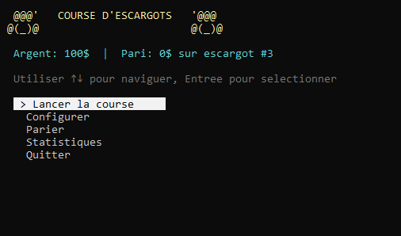

# Course d'escargots: MENU

Le but de cet exercice est de se rafraîchir les idées sur la programmation procédurale et établir une base pour de futures évolutions.

## Étape 0
Créer un projet pour gérer une course d'escargot

## Etape 1
Implémenter un menu interactif en reprenant les éléments du [tutorial](../../thematiques/01-funtab.md#menu).
1. Lancer la course
2. Configurer (nombre d'escargot, fatigue)
3. Parier
4. Statistiques
5. Quitter

### Démo interactive
[Éxécutable](snail-01.zip)