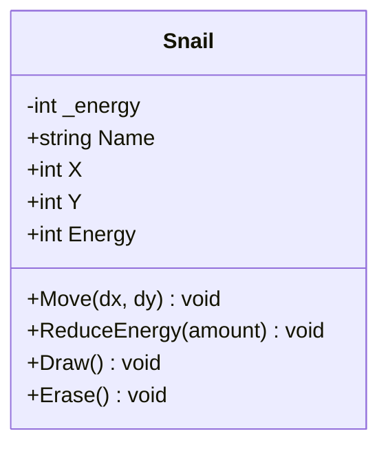
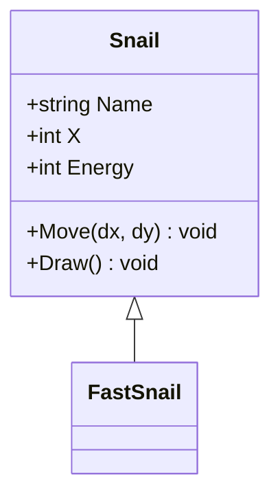
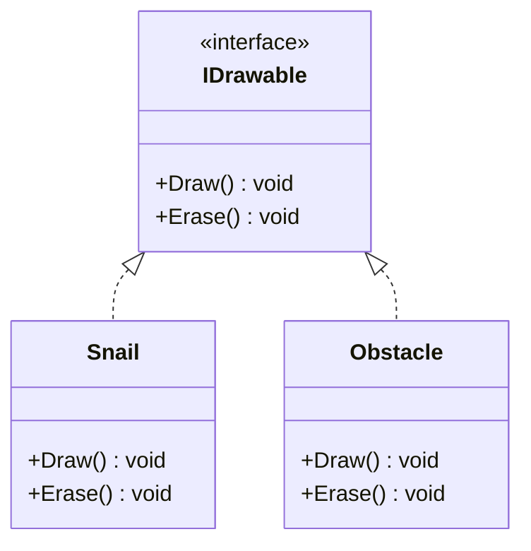
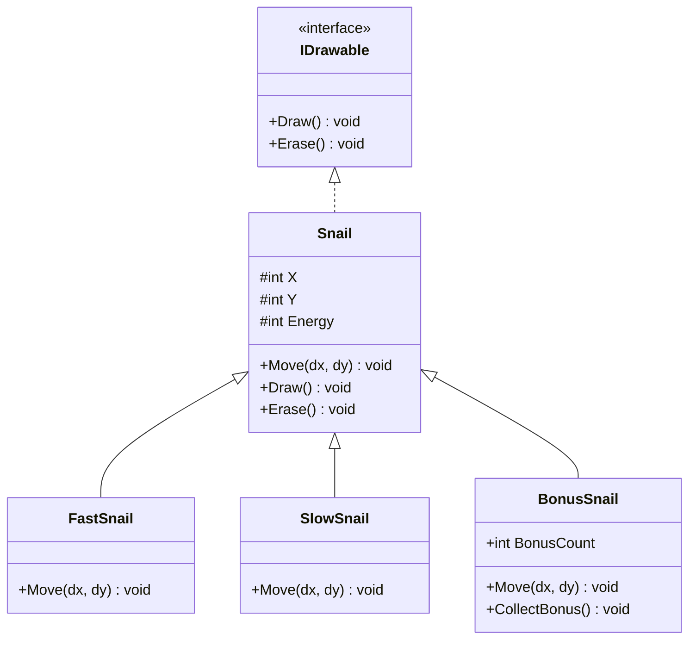

# L'Héritage

## Créer des classes spécialisées

<div class="pt-12">
  <span class="px-2 py-1 rounded bg-purple-500 text-white">
    POO : l'héritage
  </span>
</div>

---

# Plan de la présentation

1. **Rappel** - Encapsulation et escargot protégé
2. **Le problème** - Duplication de code
3. **Héritage** - La classe dérivée (`: Snail`)
4. **`base` et `protected`** - Constructeur et accès
5. **`virtual` et `override`** - Redéfinir le comportement
6. **Polymorphisme** - Un tableau, plusieurs types
7. **Interfaces** - Définir un contrat
8. **Récapitulatif** - Avant / Après

---
layout: section
---

# Partie 1
## Rappel : l'escargot encapsulé

---

# Ce qu'on sait déjà

<v-clicks>

- Les champs sont **`private`**, l'accès passe par des **propriétés**
- `{ get; private set; }` = lecture partout, écriture interne
- La **validation** est centralisée dans la propriété `Energy`
- La triche est **impossible** : `snail.Energy = 9999` ne compile pas

</v-clicks>

<v-click>

```csharp
class Snail
{
    public string Name { get; }
    public int X { get; private set; }
    public int Energy { get; private set; }

    public void Move(int dx, int dy) { X = X + dx; Y = Y + dy; }
    public void ReduceEnergy(int amount) { Energy = Energy - amount; }
}
```

</v-click>

<v-click>

<div class="mt-4 p-4 bg-blue-700 rounded text-blue-100">

Les données sont protégées. Mais tous les escargots se comportent **exactement pareil**...

</div>

</v-click>

---

# Snail en diagramme de classes UML

Le diagramme de classes **UML** représente visuellement la structure d'une classe :

<div class="grid grid-cols-2 gap-8">

<div>



</div>


<div>

### Symboles de visibilité

<v-clicks>

| UML | C#          | Accès             |
| --- | ----------- | ----------------- |
| `+` | `public`    | Partout           |
| `-` | `private`   | Classe seule      |
| `#` | `protected` | Classe + dérivées |

</v-clicks>

<v-drag-arrow pos="513,294,-337,-82" v-click/>
<v-drag-arrow pos="517,243,-382,16" v-click/>

<div class="mt-2 p-3 bg-blue-900 rounded text-blue-100 text-sm" v-click>

3 compartiments : **nom**, **attributs**, **méthodes**. Les symboles `+` `-` `#` correspondent aux modificateurs C#.

</div>
</div>
</div>

---

# Le problème : types d'escargots

On aimerait des escargots **spécialisés** :

<v-clicks>

- **FastSnail** : avance 2x plus vite
- **SlowSnail** : s'arrête quand il est fatigué (énergie ≤ 30)
- **BonusSnail** : collecte des bonus aléatoires

</v-clicks>

<v-click>

La première idée : **copier** la classe `Snail` et modifier `Move()` :

```csharp
class FastSnail
{
    // 90% du code identique à Snail...
    public void Move(int dx, int dy) { X = X + dx * 2; Y = Y + dy; }
}
```

</v-click>

<v-click>

<div class="mt-1 p-1 bg-red-700 rounded text-red-100">

**Copier-coller = danger.** 3 types = 3 copies. Un bug corrigé dans `Snail` doit être corrigé dans chaque copie. Et difficile de les mettre dans le même tableau...

</div>

</v-click>

---
layout: section
---

# Partie 2
## L'héritage : `: Snail`

---

# Hériter avec `: Snail`

<div class="grid grid-cols-2 gap-6">

<div>

### Avant : copier-coller

```csharp
class FastSnail
{
    // Copie de Name, Color, X, Y...
    // Copie de Energy + validation...
    // Copie de Draw, Erase...

    // Seul Move() change
    public void Move(int dx, int dy)
    {
        X = X + dx * 2;
        Y = Y + dy;
    }
}
```

</div>

<div>
<div v-click>

### Après : héritage

</div>

<div v-click=1>

```csharp {1,2,7|3|all}
class FastSnail : Snail
{
    // C'est tout !
    // FastSnail hérite de TOUT :
    // Name, Color, X, Y, Energy,
    // Move, ReduceEnergy, Draw, Erase
}
```
</div>

<div class="mt-2 p-3 bg-green-900 rounded text-green-100 text-sm" v-click>

**Zéro duplication.** `FastSnail` obtient tout de `Snail` automatiquement.

</div>
</div>
</div>


---

# Terminologie

<v-clicks>

| Terme              | Synonyme                    | Exemple             |
| ------------------ | --------------------------- | ------------------- |
| **Classe de base** | Classe parente, superclasse | `Snail`             |
| **Classe dérivée** | Classe enfant, sous-classe  | `FastSnail`         |
| **Hériter**        | Étendre, dériver            | `FastSnail : Snail` |

</v-clicks>

<v-click>

<div class="mt-4 p-4 bg-blue-800 rounded text-blue-100">

**Relation "is-a"** : un `FastSnail` **est un** `Snail`. Il a un nom, une position, de l'énergie — mais avec un comportement spécialisé.

</div>

</v-click>

---

<div class="grid grid-cols-2 gap-3">
<div>

# L'héritage en UML

En UML, l'héritage est une **flèche avec un triangle vide** (△) vers la classe de base :

<v-click>



</v-click>

</div>

<div v-click>

<div class="mt-48 w-128 -ml-20 p-4 bg-blue-700 rounded text-blue-100">

La flèche se lit : "`FastSnail` **hérite de** `Snail`".

`Snail` est la **super classe** (classe de base). La flèche pointe toujours vers elle.

<div class="mt-6">
`FastSnail` est vide — tout vient de la super classe pour l'instant.
</div>
</div>

</div>
</div>

---
layout: section
---

# Partie 3
## `base` et `protected`

---

# Le constructeur et `base`

La classe de base `Snail` a un constructeur avec paramètres. La dérivée **doit l'appeler** :

```csharp {0|1-2,9|3|4|3-4|5-8|all}
class FastSnail : Snail
{
    public FastSnail(string name, ConsoleColor color, int x, int y):
    base(name, color, x, y)
    {
        // Le constructeur de Snail s'exécute en premier
        // Puis le corps de FastSnail (ici, rien de spécial)
    }
}
```

<v-click>

### Ordre d'exécution

```
new FastSnail("Turbo", Yellow, 0, 2)
  → 1. Snail(name, color, x, y) s'exécute : Name="Turbo", Energy=100
  → 2. Corps de FastSnail() s'exécute : (rien de plus)
```

</v-click>

<v-click>

<div class="mt-4 p-4 bg-blue-700 rounded text-blue-100">

**`base(...)`** appelle le constructeur de la **super classe** (classe parente). Sans ça → erreur de compilation.

</div>

</v-click>

---

<div class="-mt-8">

# `protected` : le modificateur manquant

</div>

<v-clicks class="-mt-2">

| Modificateur | Accès autorisé                | Vu au chapitre...                |
| ------------ | ----------------------------- | -------------------------------- |
| `public`     | Partout                       | 04 (Instances)                   |
| `private`    | Uniquement dans la classe     | 05 (Encapsulation)               |
| `internal`   | Dans le même projet           | 05 (Encapsulation)               |
| `protected`  | Classe + classes **dérivées** | **06 (Héritage) — maintenant !** |

</v-clicks>

<v-click>

```csharp
// Snail : changer private set → protected set
public int X { get; protected set; }
public int Energy
{
    get { return _energy; }
    protected set { /* validation inchangée */ }
}
```

</v-click>

<v-click>

<div class="p-1 bg-green-700 rounded text-green-200">

**`protected set`** : les classes dérivées peuvent modifier `X` et `Energy`, mais le code extérieur ne peut toujours pas.

</div>

</v-click>

---

# Comparaison `private` vs `protected`

<div class="grid grid-cols-2 gap-8">

<div>

### `private set`

```csharp
public int X { get; private set; }
```

<v-click>

```csharp
// Dans FastSnail :
X = X + 5;  // ERREUR !
```

```csharp
// Depuis Program.cs :
snail.X = 5;  // ERREUR !
```

</v-click>

<v-click>

<div class="mt-2 p-3 bg-red-900 rounded text-red-100">

Seule la classe `Snail` peut modifier `X`.

</div>

</v-click>

</div>

<v-click>
<div>

### `protected set`

```csharp
public int X { get; protected set; }
```

```csharp
// Dans FastSnail :
X = X + 5;  // OK !
```

```csharp
// Depuis Program.cs :
snail.X = 5;  // ERREUR !
```

<div class="mt-2 p-3 bg-green-800 rounded text-green-100">

`Snail` et ses dérivées peuvent modifier. L'extérieur ne peut pas.

</div>

</div>
</v-click>

</div>

---
layout: section
---

# Partie 4
## `virtual` et `override`

---

# `virtual` : autoriser la redéfinition

Dans la classe de base, marquer la méthode avec `virtual` :

```csharp {0|1|1-3,6|all}
// Dans Snail :
public virtual void Move(int dx, int dy)
{
    X = X + dx;
    Y = Y + dy;
}
```

<v-click>

<div class="mt-4 p-4 bg-blue-700 rounded text-blue-100">

**`virtual`** = "cette méthode a un comportement par défaut, mais les classes dérivées (enfants) **peuvent** le remplacer."

</div>

</v-click>

---

# `override` : redéfinir le comportement

<div style="grid-column: 2 / 1" class="grid grid-cols-2 grid-rows-2 gap-2">
<div>

```csharp {0|4|4-7|all}
// FastSnail : avance 2x plus vite
class FastSnail : Snail
{
    public override void Move(int dx, int dy)
    {
        base.Move(dx * 2, dy);
    }
}
```

</div>
<div>

```csharp {0|1|all}
// SlowSnail : avance seulement si énergie > 30
class SlowSnail : Snail
{
    public override void Move(int dx, int dy)
    {
        if (Energy > 30)
        {
            base.Move(dx, dy);
        }
    }
}
```

</div>

<div class="col-span-2 flex justify-center rounded bg-gray-700">
```csharp {0|1|all}
// BonusSnail : bonus aléatoire entre 0 et 2
class BonusSnail : Snail
{
    private Random _rng = new Random();

    public override void Move(int dx, int dy)
    {
        int bonus = _rng.Next(0, 3);
        base.Move(dx + bonus, dy);
    }
}
```
</div>
</div>

---

# Tableau des mots-clés

<v-clicks>

| Mot-clé          | Où ?           | Rôle                       |
|------------------|----------------|----------------------------|
| `virtual`        | Classe de base | Autorise la redéfinition   |
| `override`       | Classe dérivée | Remplace le comportement   |
| `base.Move(...)` | Classe dérivée | Appelle la version parente |

</v-clicks>

<v-click>

<div class="mt-4 p-4 bg-orange-700 rounded text-white">

**Règle** : `override` n'est possible que si la méthode de base est `virtual`. Sans `virtual`, le compilateur refuse.

</div>

</v-click>

---

# `base` : enrichir ou remplacer ?

<div class="grid grid-cols-2 gap-8">

<div>

### Enrichir (avec `base`)

```csharp
// Ajoute au comportement parent
public override void Move(int dx, int dy)
{
    base.Move(dx * 2, dy); // appelle le Move() parent
	
    Console.WriteLine("Élément nouveau");
}
```

<div class="mt-2 p-3 bg-green-900 rounded text-green-100 text-sm">

Comportement parent **conservé + étendu**. Les corrections dans `Snail.Move` se propagent.

</div>

</div>

<v-click>
<div>

### Remplacer (sans `base`)

```csharp
// Ignore le comportement parent
public override void Move(int dx, int dy)
{
    X = X + dx * 5;  // Téléportation
	
	
}
```

<div class="mt-2 p-3 bg-orange-900 rounded text-orange-100 text-sm">

Comportement parent **abandonné**. Utile quand il ne convient pas du tout.

</div>

</div>
</v-click>

</div>

<v-click>

<div class="mt-4 p-4 bg-blue-800 rounded text-blue-100">

**Bonne pratique** : préférer **enrichir** (appeler `base`) quand c'est possible, dans le but de réduire la quantité de code.

</div>

</v-click>

---
layout: section
---

# Partie 5
## Le polymorphisme

---

# Un tableau, plusieurs types

Un `FastSnail` **est un** `Snail`. On peut donc mettre tous les types dans un `Snail[]` :

```csharp
Snail[] snails = new Snail[]
{
    new Snail("Normal", ConsoleColor.White, 0, 2),
    new FastSnail("Turbo", ConsoleColor.Yellow, 0, 4),
    new SlowSnail("Papy", ConsoleColor.Gray, 0, 6),
    new BonusSnail("Lucky", ConsoleColor.Green, 0, 8)
};
```

<v-click>

La boucle de course ne change pas :

```csharp
foreach (Snail snail in snails)
{
    int dx = rng.Next(1, 4);
    snail.Move(dx, 0);       // Appelle le bon Move() automatiquement !
    snail.ReduceEnergy(dx);
}
```

</v-click>

---

# Quel `Move()` est appelé ?

C# détermine **au moment de l'exécution** quelle version appeler :

<v-clicks>

| Type réel    | `snail.Move(3, 0)` | Résultat                    |
|--------------|--------------------|-----------------------------|
| `Snail`      | `Snail.Move`       | Avance de 3                 |
| `FastSnail`  | `FastSnail.Move`   | Avance de 6 (3×2)           |
| `SlowSnail`  | `SlowSnail.Move`   | Avance de 3 si énergie > 30 |
| `BonusSnail` | `BonusSnail.Move`  | Avance de 3 + bonus         |

</v-clicks>

<v-click>

<div class="mt-4 p-4 bg-green-700 rounded text-green-200">

**Polymorphisme** = "plusieurs formes". Un appel à `Move()` produit un comportement différent selon le type réel, **sans que le code appelant ait besoin de le savoir**. Si on ajoute un 5ᵉ type, la boucle ne change pas. 
Plus précisément, ce mécanisme s’appelle les ‘liaisons dynamiques’...

</div>

</v-click>

---

# La course : avant / après

<div class="grid grid-cols-2 gap-4">

<div class="bg-red-50 text-red-900 p-4 rounded">

### Avant

```csharp
// Tous identiques
Snail[] snails = new Snail[]
{
    new Snail("Turbo", Yellow, 0, 2),
    new Snail("Speedy", Cyan, 0, 4),
    new Snail("Flash", Magenta, 0, 6)
};
```

```csharp
// Un seul comportement Move()
// Pas de spécialisation possible
```

</div>

<v-click>
<div class="bg-green-50 text-green-900 p-4 rounded">

### Après

```csharp
// Types variés
Snail[] snails = new Snail[]
{
    new Snail("Normal", White, 0, 2),
    new FastSnail("Turbo", Yellow, 0, 4),
    new SlowSnail("Papy", Gray, 0, 6),
    new BonusSnail("Lucky", Green, 0, 8)
};
```

```csharp
// La boucle est IDENTIQUE
// Chaque type a son propre Move()
```

</div>
</v-click>

</div>

<v-click>

<div class="mt-4 p-4 bg-green-700 rounded text-green-100 text-center">

**Zéro duplication** et aucune branche conditionnelle (**if**), les comportements sont spécialisés par classe et la boucle de course ne change pas.
C’est une des raisons d’être de la POO !

</div>

</v-click>

---
layout: section
---

# Partie 6
## Les interfaces

---

# Qu'est-ce qu'une interface ?

Un **contrat** : une liste de méthodes qu'une classe **doit** implémenter.

<v-clicks>

```csharp
interface IDrawable
{
    void Draw();     // Pas de corps — juste la signature
    void Erase();
}
```

```csharp
class Snail : IDrawable               // Snail s'engage à implémenter Draw et Erase
{
    public void Draw() { Console.Write("@"); }
    public void Erase() { Console.Write("."); }
}
```

```csharp
class Obstacle : IDrawable             // Obstacle aussi — sans lien d'héritage avec Snail
{
    public void Draw() { Console.Write("#"); }
    public void Erase() { Console.Write(" "); }
}
```

</v-clicks>

<v-click>

<div class="mt-4 p-4 bg-blue-700 rounded text-blue-100">

Convention : les noms d'interfaces commencent par **`I`** (`IDrawable`, `IMovable`, `IBoostable`).

</div>

</v-click>

---

# Interface vs Héritage

<v-clicks>

| Aspect            | Héritage (`: Snail`)       | Interface (`: IDrawable`)    |
|-------------------|----------------------------|------------------------------|
| Fournit du code ? | Oui                        | Non (signatures seulement)   |
| Combien ?         | **1 seule** classe de base | **Plusieurs** interfaces     |
| Relation          | "est un" (is-a)            | "sait faire" (can-do)        |
| Polymorphisme     | Même famille               | Classes sans lien de parenté |

</v-clicks>

<v-click>

```csharp
// Polymorphisme par interface : Snail et Obstacle dans le même tableau
IDrawable[] elements = { new Snail(...), new Obstacle(), new Snail(...) };

foreach (IDrawable element in elements)
{
    element.Draw();  // Fonctionne pour les deux types !
}
```

</v-click>

---

# Différences clés

<v-click>

<div class="mt-4 p-4 bg-green-700 rounded text-green-200">

**Héritage** = réutiliser du code. 

**Interface** = garantir un contrat. Une classe peut avoir 1 parent mais implémenter **N** interfaces.

</div>

</v-click>

---

# Interfaces en UML

<div class="grid grid-cols-2">
<div>


</div>

<div v-click>

<div class="mt-4 p-4 bg-blue-700 rounded text-blue-100">

**Flèche en pointillés** (- - ▷) = implémente une interface. 

Contrairement à l'héritage, `l'interface` ne fournit **`pas de code`**.

</div>

</div>
</div>

---

# Hiérarchie complète en UML

<div class="grid grid-cols-[2fr_1fr] gap-1">

<div class="transform scale-75 origin-top">



</div>

<div class="mt-1 p-2 bg-green-700 rounded text-green-100 self-start" v-click>

**En un coup d'œil** : 3 classes dérivent de `Snail`,

- chacune redéfinit `Move()`

- `BonusSnail` ajoute ses propres membres

- `Snail` implémente `IDrawable` (flèche pointillée) — toutes les dérivées héritent de `Draw()` et `Erase()`

- Les `#` indiquent `protected` — modifiable par les dérivées

</div>

</div>

---

# Récapitulatif

<v-clicks>

| Concept                | Syntaxe                       | Rôle                              |
|------------------------|-------------------------------|-----------------------------------|
| Classe dérivée         | `class FastSnail : Snail`     | Hérite de tout                    |
| Constructeur parent    | `: base(name, color, x, y)`   | Initialise la partie `Snail`      |
| Appel méthode parent   | `base.Move(...)`              | Enrichit le comportement          |
| Accès protégé          | `protected set`               | Dérivées peuvent modifier         |
| `virtual` / `override` | `virtual` + `override`        | Redéfinir le comportement         |
| Polymorphisme          | `Snail[]` avec tous les types | Même boucle, comportements variés |
| Interface              | `interface IDrawable { ... }` | Contrat (sans code)               |
| Implémentation         | `class Snail : IDrawable`     | S'engage à fournir les méthodes   |

</v-clicks>

<v-click>

### Points clés

1. **`: Snail`** crée une classe dérivée qui hérite de tout
2. **`base(...)`** constructeur parent / **`base.Move(...)`** enrichir le comportement
3. **`protected`** ouvre l'accès aux dérivées sans ouvrir à l'extérieur
4. **`virtual`** + **`override`** = redéfinition du comportement
5. **Interface** = contrat sans code, complémentaire à l'héritage

</v-click>

---
layout: center
class: text-center
---

<v-click every=1>
Les escargots sont maintenant spécialisés...

<div class="pt-12 mb-4">
  <span class="px-4 py-2 rounded bg-purple-500 text-white text-xl">
    Héritage et polymorphisme !
  </span>
</div>

# Questions ?

<div class="mt-8 text-gray-500">

Prochaine étape : classes **abstraites** et **interfaces**

</div>
</v-click>
