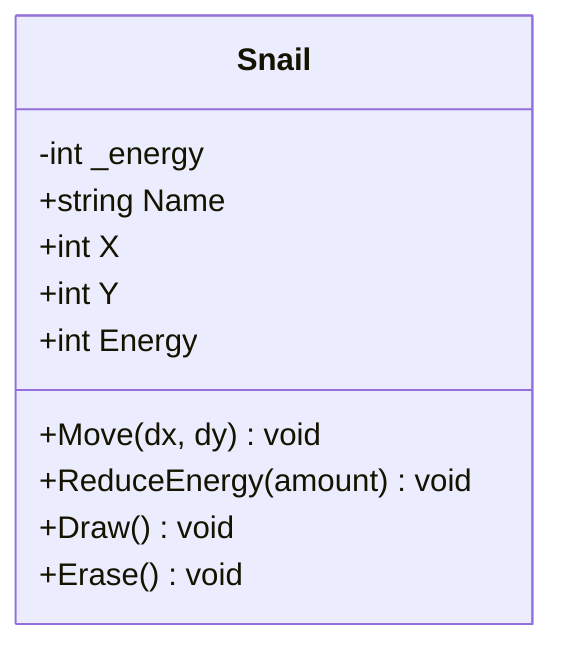
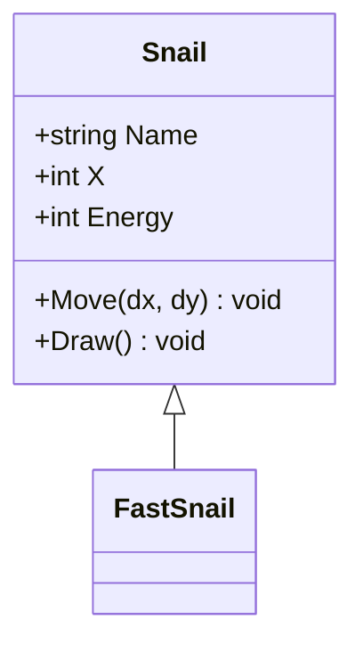

# L'Héritage – Partie A
## Créer des classes dérivées

<div class="pt-12">
  <span class="px-2 py-1 rounded bg-purple-500 text-white">
    POO : l'héritage — mécanique de base
  </span>
</div>

---

# Plan — Partie A

1. **Rappel** - Encapsulation et escargot protégé
2. **Le problème** - Duplication de code
3. **Héritage** - La classe dérivée (`: Snail`)
4. **`base` et `protected`** - Constructeur et accès

---
layout: section
---

# Partie 1
## Rappel : l'escargot encapsulé

---

# Ce qu'on sait déjà

<v-clicks>

- Les champs sont **`private`**, l'accès passe par des **propriétés**
- `{ get; private set; }` = lecture partout, écriture interne
- La **validation** est centralisée dans la propriété `Energy`
- La triche est **impossible** : `snail.Energy = 9999` ne compile pas

</v-clicks>

<v-click>

```csharp
class Snail
{
    public string Name { get; }
    public int X { get; private set; }
    public int Energy { get; private set; }

    public void Move(int dx, int dy) { X = X + dx; Y = Y + dy; }
    public void ReduceEnergy(int amount) { Energy = Energy - amount; }
}
```

</v-click>

<v-click>

<div class="mt-4 p-4 bg-blue-700 rounded text-blue-100">

Les données sont protégées. Mais tous les escargots se comportent **exactement pareil**...

</div>

</v-click>

---

# Snail en diagramme de classes UML

Le diagramme de classes **UML** représente visuellement la structure d'une classe :

<div class="grid grid-cols-2 gap-8">

<div>



</div>


<div>

### Symboles de visibilité

<v-clicks>

| UML | C#          | Accès             |
| --- | ----------- | ----------------- |
| `+` | `public`    | Partout           |
| `-` | `private`   | Classe seule      |
| `#` | `protected` | Classe + dérivées |

</v-clicks>

<v-drag-arrow pos="513,294,-337,-82" v-click/>
<v-drag-arrow pos="517,243,-382,16" v-click/>

<div class="mt-2 p-3 bg-blue-900 rounded text-blue-100 text-sm" v-click>

3 compartiments : **nom**, **attributs**, **méthodes**. Les symboles `+` `-` `#` correspondent aux modificateurs C#.

</div>
</div>
</div>

---

# Le problème : types d'escargots

On aimerait des escargots **spécialisés** :

<v-clicks>

- **FastSnail** : avance 2x plus vite
- **SlowSnail** : s'arrête quand il est fatigué (énergie ≤ 30)
- **BonusSnail** : collecte des bonus aléatoires

</v-clicks>

<v-click>

La première idée : **copier** la classe `Snail` et modifier `Move()` :

```csharp
class FastSnail
{
    // 90% du code identique à Snail...
    public void Move(int dx, int dy) { X = X + dx * 2; Y = Y + dy; }
}
```

</v-click>

<v-click>

<div class="mt-1 p-1 bg-red-700 rounded text-red-100">

**Copier-coller = danger.** 3 types = 3 copies. Un bug corrigé dans `Snail` doit être corrigé dans chaque copie. Et difficile de les mettre dans le même tableau...

</div>

</v-click>

---
layout: section
---

# Partie 2
## L'héritage : `: Snail`

---

# Hériter avec `: Snail`

<div class="grid grid-cols-2 gap-6">

<div>

### Avant : copier-coller

```csharp
class FastSnail
{
    // Copie de Name, Color, X, Y...
    // Copie de Energy + validation...
    // Copie de Draw, Erase...

    // Seul Move() change
    public void Move(int dx, int dy)
    {
        X = X + dx * 2;
        Y = Y + dy;
    }
}
```

</div>

<div>
<div v-click>

### Après : héritage

</div>

<div v-click=1>

```csharp {1,2,7|3|all}
class FastSnail : Snail
{
    // C'est tout !
    // FastSnail hérite de TOUT :
    // Name, Color, X, Y, Energy,
    // Move, ReduceEnergy, Draw, Erase
}
```
</div>

<div class="mt-2 p-3 bg-green-900 rounded text-green-100 text-sm" v-click>

**Zéro duplication.** `FastSnail` obtient tout de `Snail` automatiquement.

</div>
</div>
</div>


---

# Terminologie

<v-clicks>

| Terme              | Synonyme                    | Exemple             |
| ------------------ | --------------------------- | ------------------- |
| **Classe de base** | Classe parente, superclasse | `Snail`             |
| **Classe dérivée** | Classe enfant, sous-classe  | `FastSnail`         |
| **Hériter**        | Étendre, dériver            | `FastSnail : Snail` |

</v-clicks>

<v-click>

<div class="mt-4 p-4 bg-blue-800 rounded text-blue-100">

**Relation "is-a"** : un `FastSnail` **est un** `Snail`. Il a un nom, une position, de l'énergie — mais avec un comportement spécialisé.

</div>

</v-click>

---

<div class="grid grid-cols-2 gap-3">
<div>

# L'héritage en UML

En UML, l'héritage est une **flèche avec un triangle vide** (△) vers la classe de base :

<v-click>



</v-click>

</div>

<div v-click>

<div class="mt-48 w-128 -ml-20 p-4 bg-blue-700 rounded text-blue-100">

La flèche se lit : "`FastSnail` **hérite de** `Snail`".

`Snail` est la **super classe** (classe de base). La flèche pointe toujours vers elle.

<div class="mt-6">
`FastSnail` est vide — tout vient de la super classe pour l'instant.
</div>
</div>

</div>
</div>

---
layout: section
---

# Partie 3
## `base` et `protected`

---

# Le constructeur et `base`

La classe de base `Snail` a un constructeur avec paramètres. La dérivée **doit l'appeler** :

```csharp {0|1-2,9|3|4|3-4|5-8|all}
class FastSnail : Snail
{
    public FastSnail(string name, ConsoleColor color, int x, int y):
    base(name, color, x, y)
    {
        // Le constructeur de Snail s'exécute en premier
        // Puis le corps de FastSnail (ici, rien de spécial)
    }
}
```

<v-click>

### Ordre d'exécution

```
new FastSnail("Turbo", Yellow, 0, 2)
  → 1. Snail(name, color, x, y) s'exécute : Name="Turbo", Energy=100
  → 2. Corps de FastSnail() s'exécute : (rien de plus)
```

</v-click>

<v-click>

<div class="mt-4 p-4 bg-blue-700 rounded text-blue-100">

**`base(...)`** appelle le constructeur de la **super classe** (classe parente). Sans ça → erreur de compilation.

</div>

</v-click>

---

<div class="-mt-8">

# `protected` : le modificateur manquant

</div>

<v-clicks class="-mt-2">

| Modificateur | Accès autorisé                | Vu au chapitre...                |
| ------------ | ----------------------------- | -------------------------------- |
| `public`     | Partout                       | 04 (Instances)                   |
| `private`    | Uniquement dans la classe     | 05 (Encapsulation)               |
| `internal`   | Dans le même projet           | 05 (Encapsulation)               |
| `protected`  | Classe + classes **dérivées** | **06 (Héritage) — maintenant !** |

</v-clicks>

<v-click>

```csharp
// Snail : changer private set → protected set
public int X { get; protected set; }
public int Energy
{
    get { return _energy; }
    protected set { /* validation inchangée */ }
}
```

</v-click>

<v-click>

<div class="p-1 bg-green-700 rounded text-green-200">

**`protected set`** : les classes dérivées peuvent modifier `X` et `Energy`, mais le code extérieur ne peut toujours pas.

</div>

</v-click>

---

# Comparaison `private` vs `protected`

<div class="grid grid-cols-2 gap-8">

<div>

### `private set`

```csharp
public int X { get; private set; }
```

<v-click>

```csharp
// Dans FastSnail :
X = X + 5;  // ERREUR !
```

```csharp
// Depuis Program.cs :
snail.X = 5;  // ERREUR !
```

</v-click>

<v-click>

<div class="mt-2 p-3 bg-red-900 rounded text-red-100">

Seule la classe `Snail` peut modifier `X`.

</div>

</v-click>

</div>

<v-click>
<div>

### `protected set`

```csharp
public int X { get; protected set; }
```

```csharp
// Dans FastSnail :
X = X + 5;  // OK !
```

```csharp
// Depuis Program.cs :
snail.X = 5;  // ERREUR !
```

<div class="mt-2 p-3 bg-green-800 rounded text-green-100">

`Snail` et ses dérivées peuvent modifier. L'extérieur ne peut pas.

</div>

</div>
</v-click>

</div>

---

# Mini-synthèse — Partie A

<v-clicks>

| Concept             | Syntaxe                           | Rôle                                     |
|---------------------|-----------------------------------|------------------------------------------|
| Classe dérivée      | `class FastSnail : Snail`         | Hérite de tout (propriétés, méthodes)    |
| Constructeur parent | `: base(name, color, x, y)`       | Initialise la partie `Snail`             |
| Accès protégé       | `public int X { protected set; }` | Dérivées peuvent modifier, extérieur non |

</v-clicks>

<v-click>

```csharp
class FastSnail : Snail
{
    public FastSnail(string name, ConsoleColor color, int x, int y)
        : base(name, color, x, y)
    {
        // FastSnail hérite de Name, X, Y, Energy, Move(), Draw()...
    }
}
```

</v-click>

<v-click>

<div class="mt-0 p-1 bg-purple-700 rounded text-purple-100">

**À vous de pratiquer !** Codelab `oo-04a-heritage-intro` : créer votre première classe dérivée, sans encore utiliser `virtual` ni `override`.

</div>

</v-click>

---
layout: center
class: text-center
---

<v-click every=1>
Les bases de l'héritage sont en place...

<div class="pt-12 mb-4">
  <span class="px-4 py-2 rounded bg-purple-500 text-white text-xl">
    Partie A — Terminée !
  </span>
</div>

# Questions ?

<div class="mt-8 text-gray-500">

Prochaine étape : **`virtual`** et **`override`** — Partie B

</div>
</v-click>
