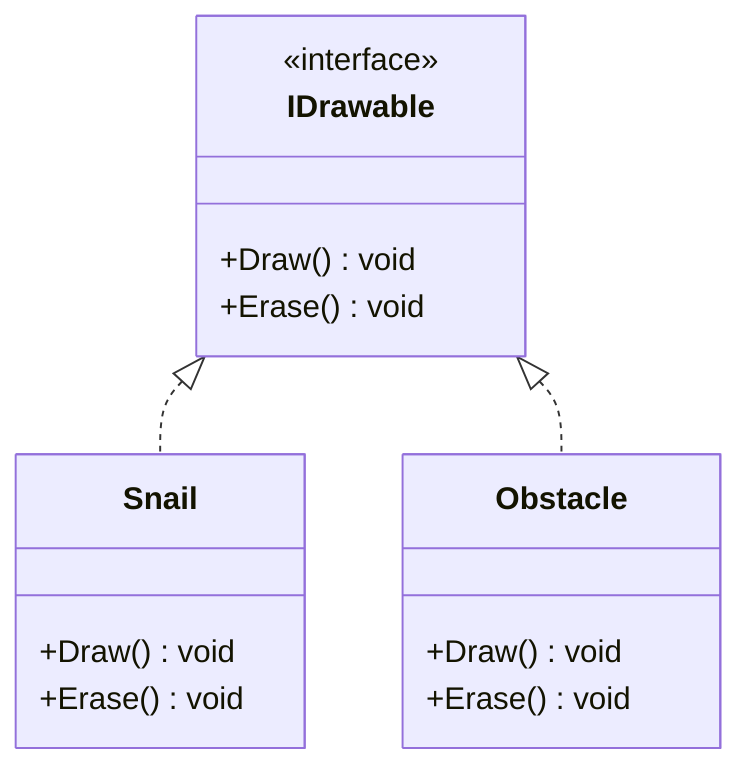
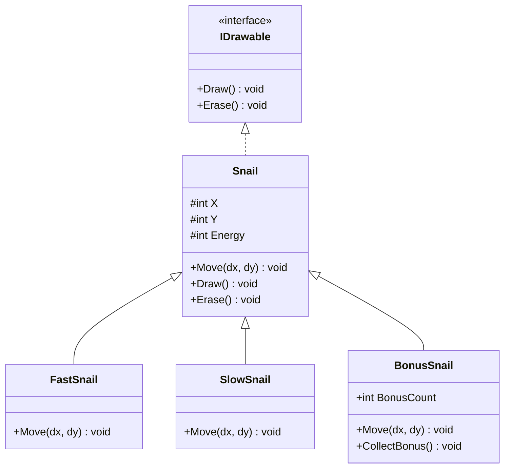

# L'Héritage – Partie B
## Spécialiser et comprendre le polymorphisme

<div class="pt-12">
  <span class="px-2 py-1 rounded bg-purple-500 text-white">
    POO : l'héritage — comportement et polymorphisme
  </span>
</div>

---

# Plan — Partie B

1. **`virtual` et `override`** - Redéfinir le comportement
2. **Polymorphisme** - Un tableau, plusieurs types
3. **Interfaces** - Définir un contrat
4. **Récapitulatif** - Avant / Après

---

# Rappel — Partie A

<v-clicks>

- **`: Snail`** → classe dérivée qui hérite de tout (propriétés, méthodes)
- **`base(...)`** → appelle le constructeur de la classe parente
- **`protected`** → accessible dans la classe et ses dérivées, pas depuis l'extérieur

</v-clicks>

<v-click>

```csharp
class FastSnail : Snail
{
    public FastSnail(string name, ConsoleColor color, int x, int y)
        : base(name, color, x, y)
    {
        // FastSnail hérite de Name, X, Y, Energy, Move(), Draw()...
    }
    // Mais Move() est encore le même que Snail → c'est ça qu'on change aujourd'hui
}
```

</v-click>

<v-click>

<div class="mt-4 p-4 bg-purple-700 rounded text-purple-100">

Aujourd'hui : **spécialiser** le comportement avec `virtual` / `override`, puis comprendre pourquoi on peut tout mettre dans un `Snail[]`.

</div>

</v-click>

---
layout: section
---

# Partie 4
## `virtual` et `override`

---

# `virtual` : autoriser la redéfinition

Dans la classe de base, marquer la méthode avec `virtual` :

```csharp {0|1|1-3,6|all}
// Dans Snail :
public virtual void Move(int dx, int dy)
{
    X = X + dx;
    Y = Y + dy;
}
```

<v-click>

<div class="mt-4 p-4 bg-blue-700 rounded text-blue-100">

**`virtual`** = "cette méthode a un comportement par défaut, mais les classes dérivées (enfants) **peuvent** le remplacer."

</div>

</v-click>

---

# `override` : redéfinir le comportement

<div style="grid-column: 2 / 1" class="grid grid-cols-2 grid-rows-2 gap-2">
<div>

```csharp {0|4|4-7|all}
// FastSnail : avance 2x plus vite
class FastSnail : Snail
{
    public override void Move(int dx, int dy)
    {
        base.Move(dx * 2, dy);
    }
}
```

</div>
<div>

```csharp {0|1|all}
// SlowSnail : avance seulement si énergie > 30
class SlowSnail : Snail
{
    public override void Move(int dx, int dy)
    {
        if (Energy > 30)
        {
            base.Move(dx, dy);
        }
    }
}
```

</div>

<div class="col-span-2 flex justify-center rounded bg-gray-700">
```csharp {0|1|all}
// BonusSnail : bonus aléatoire entre 0 et 2
class BonusSnail : Snail
{
    private Random _rng = new Random();

    public override void Move(int dx, int dy)
    {
        int bonus = _rng.Next(0, 3);
        base.Move(dx + bonus, dy);
    }
}
```
</div>
</div>

---

# Tableau des mots-clés

<v-clicks>

| Mot-clé          | Où ?           | Rôle                       |
|------------------|----------------|----------------------------|
| `virtual`        | Classe de base | Autorise la redéfinition   |
| `override`       | Classe dérivée | Remplace le comportement   |
| `base.Move(...)` | Classe dérivée | Appelle la version parente |

</v-clicks>

<v-click>

<div class="mt-4 p-4 bg-orange-700 rounded text-white">

**Règle** : `override` n'est possible que si la méthode de base est `virtual`. Sans `virtual`, le compilateur refuse.

</div>

</v-click>

---

# `base` : enrichir ou remplacer ?

<div class="grid grid-cols-2 gap-8">

<div>

### Enrichir (avec `base`)

```csharp
// Ajoute au comportement parent
public override void Move(int dx, int dy)
{
    base.Move(dx * 2, dy); // appelle le Move() parent

    Console.WriteLine("Élément nouveau");
}
```

<div class="mt-2 p-3 bg-green-900 rounded text-green-100 text-sm">

Comportement parent **conservé + étendu**. Les corrections dans `Snail.Move` se propagent.

</div>

</div>

<v-click>
<div>

### Remplacer (sans `base`)

```csharp
// Ignore le comportement parent
public override void Move(int dx, int dy)
{
    X = X + dx * 5;  // Téléportation


}
```

<div class="mt-2 p-3 bg-orange-900 rounded text-orange-100 text-sm">

Comportement parent **abandonné**. Utile quand il ne convient pas du tout.

</div>

</div>
</v-click>

</div>

<v-click>

<div class="mt-4 p-4 bg-blue-800 rounded text-blue-100">

**Bonne pratique** : préférer **enrichir** (appeler `base`) quand c'est possible, dans le but de réduire la quantité de code.

</div>

</v-click>

---
layout: section
---

# Partie 5
## Le polymorphisme

---

# Un tableau, plusieurs types

Un `FastSnail` **est un** `Snail`. On peut donc mettre tous les types dans un `Snail[]` :

```csharp
Snail[] snails = new Snail[]
{
    new Snail("Normal", ConsoleColor.White, 0, 2),
    new FastSnail("Turbo", ConsoleColor.Yellow, 0, 4),
    new SlowSnail("Papy", ConsoleColor.Gray, 0, 6),
    new BonusSnail("Lucky", ConsoleColor.Green, 0, 8)
};
```

<v-click>

La boucle de course ne change pas :

```csharp
foreach (Snail snail in snails)
{
    int dx = rng.Next(1, 4);
    snail.Move(dx, 0);       // Appelle le bon Move() automatiquement !
    snail.ReduceEnergy(dx);
}
```

</v-click>

---

# Quel `Move()` est appelé ?

C# détermine **au moment de l'exécution** quelle version appeler :

<v-clicks>

| Type réel    | `snail.Move(3, 0)` | Résultat                    |
|--------------|--------------------|-----------------------------|
| `Snail`      | `Snail.Move`       | Avance de 3                 |
| `FastSnail`  | `FastSnail.Move`   | Avance de 6 (3×2)           |
| `SlowSnail`  | `SlowSnail.Move`   | Avance de 3 si énergie > 30 |
| `BonusSnail` | `BonusSnail.Move`  | Avance de 3 + bonus         |

</v-clicks>

<v-click>

<div class="mt-4 p-4 bg-green-700 rounded text-green-200">

**Polymorphisme** = "plusieurs formes". Un appel à `Move()` produit un comportement différent selon le type réel, **sans que le code appelant ait besoin de le savoir**. Si on ajoute un 5ᵉ type, la boucle ne change pas.
Plus précisément, ce mécanisme s'appelle les 'liaisons dynamiques'...

</div>

</v-click>

---

# La course : avant / après

<div class="grid grid-cols-2 gap-4">

<div class="bg-red-50 text-red-900 p-4 rounded">

### Avant

```csharp
// Tous identiques
Snail[] snails = new Snail[]
{
    new Snail("Turbo", Yellow, 0, 2),
    new Snail("Speedy", Cyan, 0, 4),
    new Snail("Flash", Magenta, 0, 6)
};
```

```csharp
// Un seul comportement Move()
// Pas de spécialisation possible
```

</div>

<v-click>
<div class="bg-green-50 text-green-900 p-4 rounded">

### Après

```csharp
// Types variés
Snail[] snails = new Snail[]
{
    new Snail("Normal", White, 0, 2),
    new FastSnail("Turbo", Yellow, 0, 4),
    new SlowSnail("Papy", Gray, 0, 6),
    new BonusSnail("Lucky", Green, 0, 8)
};
```

```csharp
// La boucle est IDENTIQUE
// Chaque type a son propre Move()
```

</div>
</v-click>

</div>

<v-click>

<div class="mt-4 p-4 bg-green-700 rounded text-green-100 text-center">

**Zéro duplication** et aucune branche conditionnelle (**if**), les comportements sont spécialisés par classe et la boucle de course ne change pas.
C'est une des raisons d'être de la POO !

</div>

</v-click>

---
layout: section
---

# Partie 6
## Les interfaces

---

# Qu'est-ce qu'une interface ?

Un **contrat** : une liste de méthodes qu'une classe **doit** implémenter.

<v-clicks>

```csharp
interface IDrawable
{
    void Draw();     // Pas de corps — juste la signature
    void Erase();
}
```

```csharp
class Snail : IDrawable               // Snail s'engage à implémenter Draw et Erase
{
    public void Draw() { Console.Write("@"); }
    public void Erase() { Console.Write("."); }
}
```

```csharp
class Obstacle : IDrawable             // Obstacle aussi — sans lien d'héritage avec Snail
{
    public void Draw() { Console.Write("#"); }
    public void Erase() { Console.Write(" "); }
}
```

</v-clicks>

<v-click>

<div class="mt-4 p-4 bg-blue-700 rounded text-blue-100">

Convention : les noms d'interfaces commencent par **`I`** (`IDrawable`, `IMovable`, `IBoostable`).

</div>

</v-click>

---

# Interface vs Héritage

<v-clicks>

| Aspect            | Héritage (`: Snail`)       | Interface (`: IDrawable`)    |
|-------------------|----------------------------|------------------------------|
| Fournit du code ? | Oui                        | Non (signatures seulement)   |
| Combien ?         | **1 seule** classe de base | **Plusieurs** interfaces     |
| Relation          | "est un" (is-a)            | "sait faire" (can-do)        |
| Polymorphisme     | Même famille               | Classes sans lien de parenté |

</v-clicks>

<v-click>

```csharp
// Polymorphisme par interface : Snail et Obstacle dans le même tableau
IDrawable[] elements = { new Snail(...), new Obstacle(), new Snail(...) };

foreach (IDrawable element in elements)
{
    element.Draw();  // Fonctionne pour les deux types !
}
```

</v-click>

---

# Différences clés

<v-click>

<div class="mt-4 p-4 bg-green-700 rounded text-green-200">

**Héritage** = réutiliser du code.

**Interface** = garantir un contrat. Une classe peut avoir 1 parent mais implémenter **N** interfaces.

</div>

</v-click>

---

# Interfaces en UML

<div class="grid grid-cols-2">
<div>


</div>

<div v-click>

<div class="mt-4 p-4 bg-blue-700 rounded text-blue-100">

**Flèche en pointillés** (- - ▷) = implémente une interface.

Contrairement à l'héritage, `l'interface` ne fournit **`pas de code`**.

</div>

</div>
</div>

---

# Hiérarchie complète en UML

<div class="grid grid-cols-[2fr_1fr] gap-1">

<div class="transform scale-75 origin-top">



</div>

<div class="mt-1 p-2 bg-green-700 rounded text-green-100 self-start" v-click>

**En un coup d'œil** : 3 classes dérivent de `Snail`,

- chacune redéfinit `Move()`

- `BonusSnail` ajoute ses propres membres

- `Snail` implémente `IDrawable` (flèche pointillée) — toutes les dérivées héritent de `Draw()` et `Erase()`

- Les `#` indiquent `protected` — modifiable par les dérivées

</div>

</div>

---

# Récapitulatif

<v-clicks>

| Concept                | Syntaxe                       | Rôle                              |
|------------------------|-------------------------------|-----------------------------------|
| Classe dérivée         | `class FastSnail : Snail`     | Hérite de tout                    |
| Constructeur parent    | `: base(name, color, x, y)`   | Initialise la partie `Snail`      |
| Appel méthode parent   | `base.Move(...)`              | Enrichit le comportement          |
| Accès protégé          | `protected set`               | Dérivées peuvent modifier         |
| `virtual` / `override` | `virtual` + `override`        | Redéfinir le comportement         |
| Polymorphisme          | `Snail[]` avec tous les types | Même boucle, comportements variés |
| Interface              | `interface IDrawable { ... }` | Contrat (sans code)               |
| Implémentation         | `class Snail : IDrawable`     | S'engage à fournir les méthodes   |

</v-clicks>

<v-click>

### Points clés

1. **`: Snail`** crée une classe dérivée qui hérite de tout
2. **`base(...)`** constructeur parent / **`base.Move(...)`** enrichir le comportement
3. **`protected`** ouvre l'accès aux dérivées sans ouvrir à l'extérieur
4. **`virtual`** + **`override`** = redéfinition du comportement
5. **Interface** = contrat sans code, complémentaire à l'héritage

</v-click>

---
layout: center
class: text-center
---

<v-click every=1>
Les escargots sont maintenant spécialisés...

<div class="pt-12 mb-4">
  <span class="px-4 py-2 rounded bg-purple-500 text-white text-xl">
    Héritage et polymorphisme !
  </span>
</div>

# Questions ?

<div class="mt-8 text-gray-500">

Prochaine étape : classes **abstraites**

</div>
</v-click>
