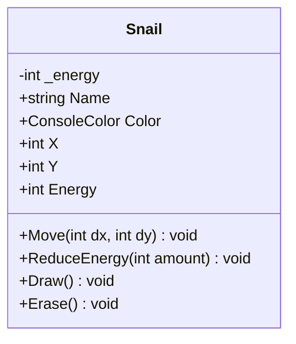
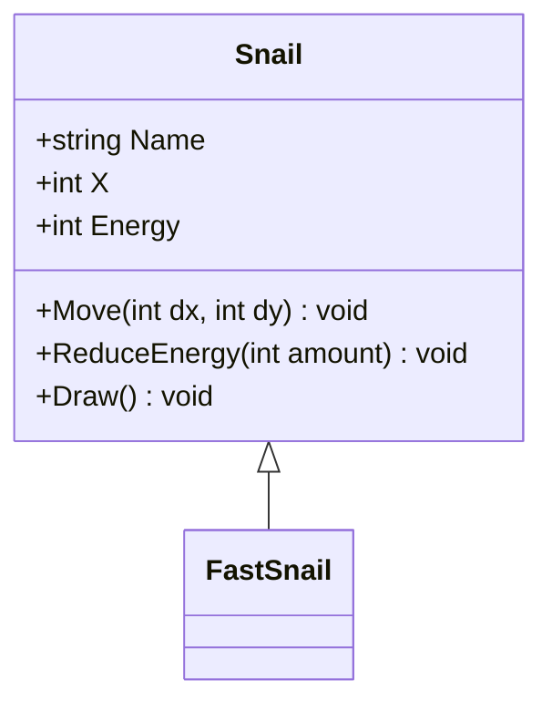
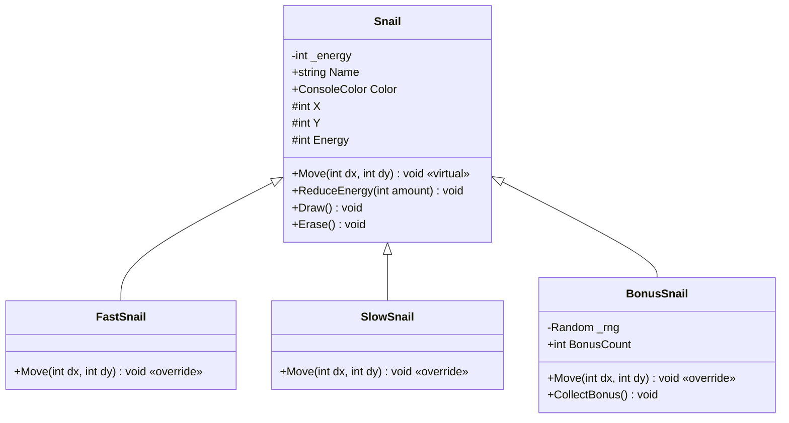
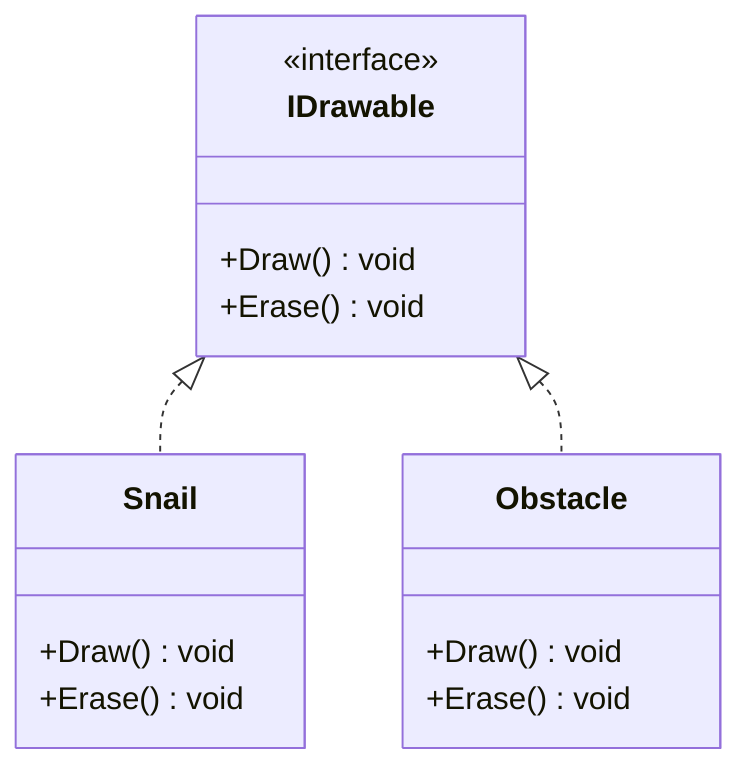
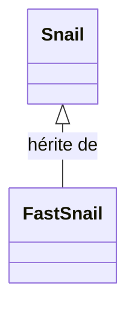

# L'Héritage

> **— PARTIE A —** Étapes 1 à 4 (jusqu'à `protected`) — slides `06a-inheritance-bases` + codelab `oo-04a-heritage-intro`

## Introduction

Au chapitre précédent, on a appris à **encapsuler** les données d'un objet : les champs sont `private`, l'accès passe par des propriétés avec validation, et la triche est impossible. Chaque escargot est protégé.

Mais il reste un problème : tous nos escargots se comportent **exactement de la même manière**. Ils avancent à la même vitesse, perdent de l'énergie au même rythme, et n'ont aucune particularité. Dans une vraie course, on aimerait avoir des **types** d'escargots :

- Un escargot **rapide** qui avance 2 fois plus vite
- Un escargot **lent** qui refuse de bouger quand il est fatigué
- Un escargot **bonus** qui collecte des bonus aléatoires

Comment créer ces types sans tout réécrire ? C'est le rôle de l'**héritage**.

## Les diagrammes de classes UML

Avant de plonger dans l'héritage, introduisons un outil visuel : le **diagramme de classes UML** (Unified Modeling Language). Il permet de représenter la structure d'un programme d'un coup d'œil, sans lire le code source.

### Représenter une classe

Une classe est représentée par un rectangle divisé en **3 compartiments** :

| Compartiment              | Contenu              | Exemple                 |
| ------------------------- | -------------------- | ----------------------- |
| **Nom** (en haut)         | Le nom de la classe  | `Snail`                 |
| **Attributs** (au milieu) | Champs et propriétés | `+ Name : string`       |
| **Méthodes** (en bas)     | Les méthodes         | `+ Move(dx, dy) : void` |

### Symboles de visibilité

Chaque membre est précédé d'un symbole qui indique sa **visibilité** — les mêmes modificateurs d'accès qu'en C# :

| Symbole UML | Modificateur C# | Signification                             |
| ----------- | --------------- | ----------------------------------------- |
| `+`         | `public`        | Accessible partout                        |
| `-`         | `private`       | Accessible uniquement dans la classe      |
| `#`         | `protected`     | Accessible dans la classe et ses dérivées |

### La classe Snail en UML

Voici notre classe `Snail` encapsulée représentée en diagramme de classes :



On retrouve :
- Le champ privé `_energy` précédé de `-` (private)
- Les propriétés publiques précédées de `+` (public)
- Les méthodes publiques dans le compartiment du bas

> **À retenir** : le diagramme de classes UML est un outil de **communication**. Il montre la structure d'un programme d'un coup d'œil. On l'utilisera tout au long de ce chapitre pour visualiser les relations d'héritage.

## Étape 1 : Le problème de la duplication

### La classe Snail encapsulée (rappel)

Voici la classe `Snail` telle qu'on l'a laissée à la fin du module encapsulation :

```csharp
class Snail
{
    private int _energy;

    public string Name { get; }
    public ConsoleColor Color { get; }
    public int X { get; private set; }
    public int Y { get; private set; }

    public int Energy
    {
        get { return _energy; }
        private set
        {
            if (value < 10)
                _energy = 10;
            else if (value > 100)
                _energy = 100;
            else
                _energy = value;
        }
    }

    public Snail(string name, ConsoleColor color, int x, int y)
    {
        Name = name;
        Color = color;
        X = x;
        Y = y;
        Energy = 100;
    }

    public void Move(int dx, int dy)
    {
        X = X + dx;
        Y = Y + dy;
    }

    public void ReduceEnergy(int amount)
    {
        Energy = Energy - amount;
    }

    public void Draw()
    {
        Console.SetCursorPosition(X, Y);
        Console.Write("@");
    }

    public void Erase()
    {
        Console.SetCursorPosition(X, Y);
        Console.Write(".");
    }
}
```

### Créer un FastSnail par copier-coller

Si on veut un escargot rapide, la première idée serait de **copier** la classe entière et de modifier `Move()` :

```csharp
class FastSnail
{
    private int _energy;

    public string Name { get; }
    public ConsoleColor Color { get; }
    public int X { get; private set; }
    public int Y { get; private set; }

    public int Energy
    {
        get { return _energy; }
        private set { /* ... même validation ... */ }
    }

    public FastSnail(string name, ConsoleColor color, int x, int y)
    {
        Name = name;
        Color = color;
        X = x;
        Y = y;
        Energy = 100;
    }

    // Seule différence : dx * 2
    public void Move(int dx, int dy)
    {
        X = X + dx * 2;
        Y = Y + dy;
    }

    public void ReduceEnergy(int amount) { Energy = Energy - amount; }
    public void Draw() { /* ... identique ... */ }
    public void Erase() { /* ... identique ... */ }
}
```

### Pourquoi c'est un problème ?

| Problème                   | Conséquence                                                          |
| -------------------------- | -------------------------------------------------------------------- |
| **Duplication massive**    | 90 % du code est identique à `Snail`                                 |
| **Maintenance double**     | Un bug corrigé dans `Snail` doit être corrigé aussi dans `FastSnail` |
| **Incohérence**            | Rien ne garantit que `FastSnail` reste synchronisé avec `Snail`      |
| **Explosion combinatoire** | 3 types = 3 copies. 10 types = 10 copies. Ingérable.                 |
| **Pas de polymorphisme**   | Impossible de mettre `Snail` et `FastSnail` dans le même tableau     |

Et si on veut aussi `SlowSnail` et `BonusSnail`, il faudrait **3 copies** de la même classe avec des variations mineures. C'est exactement le problème que l'héritage résout.

> **Principe** : quand plusieurs classes partagent le même code avec de petites variations, l'héritage permet de **factoriser** le code commun dans une classe de base et de ne redéfinir que ce qui change.

## Étape 2 : La classe dérivée (`: Snail`)

### Syntaxe

En C#, on crée une classe dérivée avec le symbole `:` suivi du nom de la classe parente :

```csharp
class FastSnail : Snail
{
}
```

C'est tout. `FastSnail` **hérite** de tout ce que `Snail` possède :
- Les propriétés (`Name`, `Color`, `X`, `Y`, `Energy`)
- Les méthodes (`Move`, `ReduceEnergy`, `Draw`, `Erase`)
- Le constructeur doit être appelé explicitement (étape suivante)

### Terminologie

| Terme              | Synonymes                   | Exemple                       |
| ------------------ | --------------------------- | ----------------------------- |
| **Classe de base** | Classe parente, superclasse | `Snail`                       |
| **Classe dérivée** | Classe enfant, sous-classe  | `FastSnail`                   |
| **Hériter**        | Étendre, dériver            | `FastSnail` hérite de `Snail` |

On dit que `FastSnail` **est un** `Snail` (relation "is-a"). Un escargot rapide reste un escargot — il a un nom, une position, de l'énergie — mais avec un comportement spécialisé.

### En UML : la flèche d'héritage

En UML, l'héritage est représenté par une **flèche avec un triangle vide** (△) pointant de la classe dérivée vers la classe de base :



La flèche se lit : "`FastSnail` **hérite de** `Snail`". `Snail` est la **super classe** (classe de base) — la flèche pointe toujours vers elle. `FastSnail` est vide car il n'a pas encore de membres propres — tout vient de la super classe.

### Ce qui est hérité

```csharp
FastSnail turbo = new FastSnail("Turbo", ConsoleColor.Yellow, 0, 2);

// Tout ce qui vient de Snail fonctionne :
Console.WriteLine(turbo.Name);     // "Turbo"
Console.WriteLine(turbo.Energy);   // 100
turbo.Move(3, 0);                  // Avance (hérité de Snail)
turbo.Draw();                      // Dessine (hérité de Snail)
```

> **À retenir** : une classe dérivée hérite automatiquement de tous les membres `public` et `protected` de sa classe de base. Les membres `private` existent dans l'objet mais ne sont pas accessibles directement depuis la classe dérivée.

## Étape 3 : Le mot-clé `base`

### Le problème du constructeur

La classe `Snail` a un constructeur qui initialise `Name`, `Color`, `X`, `Y` et `Energy`. La classe dérivée doit **appeler ce constructeur** pour que l'initialisation se fasse correctement.

Si on essaie de créer un constructeur dans `FastSnail` sans appeler celui de `Snail` :

```csharp
class FastSnail : Snail
{
    public FastSnail(string name, ConsoleColor color, int x, int y)
    {
        // ERREUR : 'Snail' does not contain a parameterless constructor
    }
}
```

Le compilateur demande un constructeur sans paramètre dans `Snail`, qui n'existe pas. Il faut **appeler explicitement** le constructeur de la classe de base.

### La syntaxe `base(...)`

Le mot-clé `base` désigne la **super classe** (classe parente). On l'utilise après `:` dans la signature du constructeur :

```csharp
class FastSnail : Snail
{
    public FastSnail(string name, ConsoleColor color, int x, int y)
        : base(name, color, x, y)
    {
        // Le constructeur de Snail est appelé en premier
        // Ici on peut ajouter de l'initialisation spécifique à FastSnail
    }
}
```

L'ordre d'exécution est :
1. Le constructeur de `Snail` s'exécute (`base(name, color, x, y)`)
2. Le corps du constructeur de `FastSnail` s'exécute ensuite

### Exemple concret

```csharp
FastSnail turbo = new FastSnail("Turbo", ConsoleColor.Yellow, 0, 2);
// 1. Snail(name, color, x, y) → Name="Turbo", Color=Yellow, X=0, Y=2, Energy=100
// 2. Corps de FastSnail() → (rien de spécial pour l'instant)
```

> **À retenir** : si la classe de base a un constructeur avec paramètres, la classe dérivée **doit** l'appeler avec `base(...)`. Les paramètres sont transmis au constructeur parent.

### Initialisation spécifique dans la dérivée

Le constructeur de la dérivée peut faire **plus** qu'appeler `base(...)`. Il peut initialiser ses propres membres après l'appel au constructeur parent :

```csharp
class BonusSnail : Snail
{
    private Random _rng = new Random();
    public int BonusCount { get; private set; }

    public BonusSnail(string name, ConsoleColor color, int x, int y)
        : base(name, color, x, y)
    {
        // 1. base() → Name, Color, X, Y, Energy sont initialisés par Snail
        // 2. Puis on initialise les membres propres à BonusSnail :
        BonusCount = 0;
    }
}
```

L'ordre est toujours le même :
1. `base(...)` s'exécute → la partie `Snail` est initialisée
2. Le corps du constructeur de `BonusSnail` s'exécute → les membres spécifiques sont initialisés

On peut aussi passer des **valeurs différentes** au constructeur parent. Par exemple, un escargot qui démarre avec moins d'énergie nécessiterait un constructeur parent adapté, ou une initialisation spécifique après `base()`.

### `base` au-delà du constructeur

Le mot-clé `base` ne sert pas uniquement dans le constructeur. Dans une méthode redéfinie (`override`), `base.Method(...)` permet d'appeler la **version originale** de la méthode parente. On verra cela en détail à l'étape 5.

| Contexte | Syntaxe | Rôle |
| --- | --- | --- |
| Constructeur | `: base(...)` | Appelle le constructeur parent |
| Méthode redéfinie | `base.Move(...)` | Appelle la méthode parente |

## Étape 4 : Le modificateur `protected`

### Rappel du chapitre encapsulation

Au chapitre 5, on a vu le tableau des modificateurs d'accès :

| Modificateur | Accès autorisé                             |
| ------------ | ------------------------------------------ |
| `public`     | Partout                                    |
| `private`    | Uniquement dans la classe                  |
| `internal`   | Dans le même projet (assembly)             |
| `protected`  | Dans la classe et ses **classes dérivées** |

À l'époque, on avait dit : *"`protected` sera vu avec l'héritage"*. C'est maintenant.

### Le problème avec `private set`

Dans notre classe `Snail` encapsulée, les propriétés utilisent `private set` :

```csharp
public int X { get; private set; }
public int Energy
{
    get { return _energy; }
    private set { /* validation */ }
}
```

`private set` signifie que **seule la classe `Snail`** peut modifier `X` et `Energy`. Même une classe dérivée comme `FastSnail` ne peut pas :

```csharp
class FastSnail : Snail
{
    public void SpecialMove()
    {
        X = X + 5;       // ERREUR ! private set → inaccessible
        Energy = Energy + 10;  // ERREUR ! private set → inaccessible
    }
}
```

### La solution : `protected set`

En remplaçant `private set` par `protected set`, on autorise les classes dérivées à modifier la propriété, tout en interdisant l'accès depuis l'extérieur :

```csharp
class Snail
{
    private int _energy;

    public string Name { get; }
    public ConsoleColor Color { get; }
    public int X { get; protected set; }
    public int Y { get; protected set; }

    public int Energy
    {
        get { return _energy; }
        protected set
        {
            if (value < 10)
                _energy = 10;
            else if (value > 100)
                _energy = 100;
            else
                _energy = value;
        }
    }

    // ... reste inchangé
}
```

### Tableau complet des accès

| Qui accède ?                    | `public` | `protected` | `private` |
| ------------------------------- | -------- | ----------- | --------- |
| Dans la classe `Snail`          | Oui      | Oui         | Oui       |
| Dans `FastSnail` (dérivée)      | Oui      | Oui         | **Non**   |
| Depuis `Program.cs` (extérieur) | Oui      | **Non**     | **Non**   |

```csharp
// Depuis FastSnail (classe dérivée) :
Energy = Energy + 10;  // OK : protected set → accessible

// Depuis Program.cs (extérieur) :
snail.Energy = 9999;   // ERREUR : protected set → inaccessible
```

### Quand utiliser `protected set` ?

| Syntaxe                   | Qui peut modifier ?       | Cas d'usage                                           |
| ------------------------- | ------------------------- | ----------------------------------------------------- |
| `{ get; private set; }`   | La classe seulement       | Données internes, pas de dérivation prévue            |
| `{ get; protected set; }` | La classe et ses dérivées | Données que les sous-classes doivent pouvoir modifier |
| `{ get; set; }`           | Tout le monde             | Données sans restriction (rare avec encapsulation)    |

> **Bonne pratique** : préférez `private set` par défaut. Passez à `protected set` uniquement quand une classe dérivée a besoin de modifier la propriété. Le principe du **moindre privilège** s'applique : n'ouvrez que ce qui est nécessaire.

> **— PARTIE B —** Étapes 5 à 9 (`virtual`, polymorphisme, interfaces) — slides `06b-inheritance-comportement` + codelab `oo-04-inheritance`

## Étape 5 : `virtual` et `override`

### Le problème : Move() fait la même chose partout

Actuellement, `FastSnail` hérite de `Move()` tel quel. Un escargot rapide avance exactement comme un escargot normal. Pour changer le comportement, il faut pouvoir **redéfinir** la méthode.

### `virtual` : autoriser la redéfinition

Dans la classe de base, on marque la méthode avec `virtual` pour indiquer qu'elle **peut être redéfinie** par une classe dérivée :

```csharp
class Snail
{
    // ...

    public virtual void Move(int dx, int dy)
    {
        X = X + dx;
        Y = Y + dy;
    }
}
```

`virtual` signifie : "cette méthode a un comportement par défaut, mais les classes dérivées peuvent le remplacer".

### `override` : redéfinir le comportement

Dans la classe dérivée, on utilise `override` pour fournir une **nouvelle implémentation** :

#### FastSnail : avance 2 fois plus vite

```csharp
class FastSnail : Snail
{
    public FastSnail(string name, ConsoleColor color, int x, int y)
        : base(name, color, x, y)
    {
    }

    public override void Move(int dx, int dy)
    {
        base.Move(dx * 2, dy);  // Appelle Snail.Move avec le double
    }
}
```

`base.Move(...)` appelle la version de la super classe. `FastSnail` délègue le déplacement à `Snail` mais en doublant la distance horizontale.

#### SlowSnail : avance seulement si énergie > 30

```csharp
class SlowSnail : Snail
{
    public SlowSnail(string name, ConsoleColor color, int x, int y)
        : base(name, color, x, y)
    {
    }

    public override void Move(int dx, int dy)
    {
        if (Energy > 30)
        {
            base.Move(dx, dy);  // Avance normalement si assez d'énergie
        }
        // Sinon : ne bouge pas du tout
    }
}
```

#### BonusSnail : bonus aléatoire

```csharp
class BonusSnail : Snail
{
    private Random _rng = new Random();

    public BonusSnail(string name, ConsoleColor color, int x, int y)
        : base(name, color, x, y)
    {
    }

    public override void Move(int dx, int dy)
    {
        int bonus = _rng.Next(0, 3);  // Bonus entre 0 et 2
        base.Move(dx + bonus, dy);
    }
}
```

### Résumé des mots-clés

| Mot-clé         | Où ?           | Rôle                                              |
| --------------- | -------------- | ------------------------------------------------- |
| `virtual`       | Classe de base | Autorise la redéfinition de la méthode            |
| `override`      | Classe dérivée | Remplace le comportement par une nouvelle version |
| `base.Method()` | Classe dérivée | Appelle la version originale de la classe parente |

> **Règle** : `override` n'est possible que si la méthode de base est marquée `virtual`. Sans `virtual`, le compilateur refuse `override`.

### Enrichir vs Remplacer : deux usages de `base.Method()`

Quand on redéfinit une méthode avec `override`, deux stratégies sont possibles selon qu'on appelle ou non la méthode parente.

#### Stratégie 1 : Enrichir (appeler `base`)

La dérivée **ajoute** du comportement au comportement existant. C'est le cas le plus courant — nos trois classes dérivées l'utilisent :

```csharp
// FastSnail ENRICHIT Move : appelle base.Move avec des paramètres modifiés
public override void Move(int dx, int dy)
{
    base.Move(dx * 2, dy);  // Fait ce que Snail fait, mais en doublant dx
}
```

Le comportement de base est **conservé** et **étendu**. Si demain `Snail.Move()` ajoute une animation ou un effet sonore, `FastSnail` en bénéficiera automatiquement car il appelle `base.Move()`.

On peut aussi enrichir en ajoutant du code **avant** ou **après** l'appel à `base` :

```csharp
public override void Move(int dx, int dy)
{
    Console.WriteLine("Boost !");   // Avant : effet spécifique
    base.Move(dx * 2, dy);          // Appel au comportement parent
    Energy = Energy - 5;             // Après : coût supplémentaire
}
```

#### Stratégie 2 : Remplacer (sans appeler `base`)

La dérivée **ignore** complètement le comportement parent et fournit le sien :

```csharp
// GhostSnail REMPLACE Move : ne fait pas du tout ce que Snail fait
public override void Move(int dx, int dy)
{
    // Pas de base.Move() !
    // Se téléporte au lieu de marcher
    X = X + dx * 5;
    // Pas de déplacement en Y
}
```

Le comportement de base est **abandonné**. Si `Snail.Move()` est modifié plus tard, `GhostSnail` ne sera pas affecté.

#### Quand choisir ?

| Stratégie     | `base.Method()` appelé ? | Quand l'utiliser ?                                                  |
| ------------- | ------------------------ | ------------------------------------------------------------------- |
| **Enrichir**  | Oui                      | Le comportement de base est valide, on veut y ajouter quelque chose |
| **Remplacer** | Non                      | Le comportement de base ne convient pas du tout                     |

> **Bonne pratique** : préférez **enrichir** (appeler `base`) quand c'est possible. Cela rend le code plus maintenable : les corrections dans la classe de base se propagent automatiquement aux classes dérivées.

## Étape 6 : Le polymorphisme

### Un tableau, plusieurs types

Le concept le plus puissant de l'héritage est le **polymorphisme** : un objet de type dérivé peut être utilisé partout où un objet de type base est attendu.

Concrètement, on peut mettre tous les types d'escargots dans un tableau de `Snail` :

```csharp
Snail[] snails = new Snail[]
{
    new Snail("Normal", ConsoleColor.White, 0, 2),
    new FastSnail("Turbo", ConsoleColor.Yellow, 0, 4),
    new SlowSnail("Papy", ConsoleColor.Gray, 0, 6),
    new BonusSnail("Lucky", ConsoleColor.Green, 0, 8)
};
```

Le tableau est de type `Snail[]`, mais il contient des `FastSnail`, `SlowSnail` et `BonusSnail`. C'est possible parce qu'un `FastSnail` **est un** `Snail`.

### La boucle ne change pas

La boucle de course traite tous les escargots de la même manière :

```csharp
Random rng = new Random();

foreach (Snail snail in snails)
{
    int dx = rng.Next(1, 4);
    snail.Move(dx, 0);         // Appelle le bon Move() automatiquement
    snail.ReduceEnergy(dx);
    snail.Draw();
}
```

Le code appelle `snail.Move(dx, 0)` sans se soucier du type réel. C# détermine **au moment de l'exécution** quel `Move()` appeler :

| Objet réel   | `snail.Move(dx, 0)` appelle... | Comportement                               |
| ------------ | ------------------------------ | ------------------------------------------ |
| `Snail`      | `Snail.Move`                   | Avance de `dx`                             |
| `FastSnail`  | `FastSnail.Move`               | Avance de `dx * 2`                         |
| `SlowSnail`  | `SlowSnail.Move`               | Avance de `dx` si énergie > 30, sinon rien |
| `BonusSnail` | `BonusSnail.Move`              | Avance de `dx + bonus`                     |

### Pourquoi c'est puissant ?

Sans polymorphisme, il faudrait écrire :

```csharp
// MAUVAIS : sans polymorphisme
if (snail is FastSnail fast)
{
    fast.Move(dx, 0);
}
else if (snail is SlowSnail slow)
{
    slow.Move(dx, 0);
}
else if (snail is BonusSnail bonus)
{
    bonus.Move(dx, 0);
}
else
{
    snail.Move(dx, 0);
}
```

Avec le polymorphisme, une seule ligne suffit. Et si on ajoute un 5ᵉ type d'escargot, **la boucle ne change pas**.

> **Polymorphisme** (du grec "plusieurs formes") : la capacité d'un objet à prendre différentes formes. Un appel à `Move()` produit un comportement différent selon le type réel de l'objet, sans que le code appelant ait besoin de le savoir.

## Étape 7 : Ajouter des membres dans une classe dérivée

### BonusSnail : membres spécifiques

Une classe dérivée peut non seulement redéfinir des méthodes, mais aussi **ajouter** de nouveaux membres. `BonusSnail` a un compteur de bonus et une méthode de collecte :

```csharp
class BonusSnail : Snail
{
    private Random _rng = new Random();

    public int BonusCount { get; private set; }

    public BonusSnail(string name, ConsoleColor color, int x, int y)
        : base(name, color, x, y)
    {
        BonusCount = 0;
    }

    public override void Move(int dx, int dy)
    {
        int bonus = _rng.Next(0, 3);
        base.Move(dx + bonus, dy);
    }

    public void CollectBonus()
    {
        Energy = Energy + 10;  // protected set → autorisé
        BonusCount = BonusCount + 1;
    }
}
```

`CollectBonus()` est une méthode qui n'existe que dans `BonusSnail`. Elle utilise `protected set` sur `Energy` pour ajouter de l'énergie (la validation dans la propriété garantit que ça ne dépasse pas 100).

### Accéder aux membres spécifiques

Quand on parcourt un tableau de `Snail[]`, on ne peut accéder qu'aux membres de `Snail`. Pour utiliser `CollectBonus()`, il faut vérifier le type avec `is` :

```csharp
foreach (Snail snail in snails)
{
    snail.Move(dx, 0);

    // Vérifier si c'est un BonusSnail
    if (snail is BonusSnail bonusSnail)
    {
        bonusSnail.CollectBonus();
        Console.WriteLine($"Bonus #{bonusSnail.BonusCount} !");
    }
}
```

Le mot-clé `is` vérifie le type réel de l'objet **et** le convertit dans une variable typée (`bonusSnail`). C'est une forme de **pattern matching** en C#.

### Ce que la classe dérivée peut faire

| Action                         | Exemple                                 | Mot-clé                              |
| ------------------------------ | --------------------------------------- | ------------------------------------ |
| Hériter des membres            | `Name`, `Energy`, `Draw()`              | `: Snail`                            |
| Appeler le constructeur parent | `base(name, color, x, y)`               | `base(...)`                          |
| Redéfinir une méthode          | `Move()` avec un comportement différent | `override`                           |
| Ajouter des membres            | `BonusCount`, `CollectBonus()`          | (aucun — on les déclare normalement) |
| Accéder aux membres protégés   | `Energy = Energy + 10`                  | `protected`                          |

## Étape 8 : La course avec héritage (version complète)

### Avant : une seule classe, tous identiques

```csharp
// Tous les escargots se comportent pareil
Snail[] snails = new Snail[]
{
    new Snail("Turbo", ConsoleColor.Yellow, 0, 2),
    new Snail("Speedy", ConsoleColor.Cyan, 0, 4),
    new Snail("Flash", ConsoleColor.Magenta, 0, 6)
};

// Boucle de course
Random rng = new Random();
while (true)
{
    foreach (Snail snail in snails)
    {
        int dx = rng.Next(1, 4);
        snail.Move(dx, 0);
        snail.ReduceEnergy(dx);
    }
}
```

### Après : des types variés, la boucle identique

```csharp
// Chaque escargot a un comportement unique
Snail[] snails = new Snail[]
{
    new Snail("Normal", ConsoleColor.White, 0, 2),
    new FastSnail("Turbo", ConsoleColor.Yellow, 0, 4),
    new SlowSnail("Papy", ConsoleColor.Gray, 0, 6),
    new BonusSnail("Lucky", ConsoleColor.Green, 0, 8)
};

// La boucle de course est IDENTIQUE
Random rng = new Random();
while (true)
{
    foreach (Snail snail in snails)
    {
        int dx = rng.Next(1, 4);
        snail.Move(dx, 0);       // Polymorphisme : chaque type a son Move()
        snail.ReduceEnergy(dx);
    }
}
```

### Ce qui a changé

| Aspect                  | Avant                     | Après                                        |
| ----------------------- | ------------------------- | -------------------------------------------- |
| Types d'escargots       | 1 seul (`Snail`)          | 4 types différents                           |
| Comportement `Move()`   | Identique pour tous       | Spécialisé par type                          |
| Boucle de course        | `foreach (Snail ...)`     | `foreach (Snail ...)` — **identique**        |
| Ajout d'un nouveau type | Impossible sans `if/else` | Créer une classe `: Snail` + `override Move` |
| Code dupliqué           | 0 %                       | 0 %                                          |

### La classe Snail de base (version finale)

```csharp
class Snail
{
    private int _energy;

    public string Name { get; }
    public ConsoleColor Color { get; }
    public int X { get; protected set; }
    public int Y { get; protected set; }

    public int Energy
    {
        get { return _energy; }
        protected set
        {
            if (value < 10)
                _energy = 10;
            else if (value > 100)
                _energy = 100;
            else
                _energy = value;
        }
    }

    public Snail(string name, ConsoleColor color, int x, int y)
    {
        Name = name;
        Color = color;
        X = x;
        Y = y;
        Energy = 100;
    }

    public virtual void Move(int dx, int dy)
    {
        X = X + dx;
        Y = Y + dy;
    }

    public void ReduceEnergy(int amount)
    {
        Energy = Energy - amount;
    }

    public void Draw()
    {
        Console.SetCursorPosition(X, Y);
        Console.Write("@");
    }

    public void Erase()
    {
        Console.SetCursorPosition(X, Y);
        Console.Write(".");
    }
}
```

### Les classes dérivées

```csharp
class FastSnail : Snail
{
    public FastSnail(string name, ConsoleColor color, int x, int y)
        : base(name, color, x, y)
    {
    }

    public override void Move(int dx, int dy)
    {
        base.Move(dx * 2, dy);
    }
}

class SlowSnail : Snail
{
    public SlowSnail(string name, ConsoleColor color, int x, int y)
        : base(name, color, x, y)
    {
    }

    public override void Move(int dx, int dy)
    {
        if (Energy > 30)
        {
            base.Move(dx, dy);
        }
    }
}

class BonusSnail : Snail
{
    private Random _rng = new Random();

    public int BonusCount { get; private set; }

    public BonusSnail(string name, ConsoleColor color, int x, int y)
        : base(name, color, x, y)
    {
        BonusCount = 0;
    }

    public override void Move(int dx, int dy)
    {
        int bonus = _rng.Next(0, 3);
        base.Move(dx + bonus, dy);
    }

    public void CollectBonus()
    {
        Energy = Energy + 10;
        BonusCount = BonusCount + 1;
    }
}
```

### Vue d'ensemble en UML

Voici la hiérarchie complète des escargots en diagramme de classes UML :



Ce diagramme montre d'un coup d'œil :
- **La hiérarchie** : trois classes dérivent de `Snail` (flèches △)
- **Les membres hérités** : `Name`, `X`, `Energy`, `Draw()`, etc. sont dans `Snail` et disponibles dans toutes les dérivées
- **La visibilité** : `#` (protected) pour `X`, `Y`, `Energy` — modifiables par les dérivées mais pas par le code extérieur
- **Les redéfinitions** : `Move()` est `«virtual»` dans `Snail` et `«override»` dans chaque dérivée
- **Les membres ajoutés** : `BonusSnail` a ses propres membres (`BonusCount`, `CollectBonus()`)

## Étape 9 : Les interfaces

### Qu'est-ce qu'une interface ?

Une **interface** est un **contrat** : elle définit un ensemble de méthodes qu'une classe **doit** implémenter, sans fournir le code. C'est une liste de "ce que l'objet sait faire", pas "comment il le fait".

```csharp
interface IDrawable
{
    void Draw();
    void Erase();
}
```

Une interface ne contient **que des signatures** de méthodes (pas de corps, pas de champs, pas de constructeur). Par convention, le nom commence par `I` majuscule (`IDrawable`, `IMovable`, `IBoostable`).

### Implémenter une interface

Une classe implémente une interface avec la même syntaxe `:` que l'héritage :

```csharp
class Snail : IDrawable
{
    // La classe DOIT fournir Draw() et Erase(), sinon → erreur de compilation
    public void Draw()
    {
        Console.SetCursorPosition(X, Y);
        Console.Write("@");
    }

    public void Erase()
    {
        Console.SetCursorPosition(X, Y);
        Console.Write(".");
    }
}
```

Le compilateur **vérifie** que la classe fournit bien toutes les méthodes de l'interface. Si `Draw()` ou `Erase()` manque → erreur de compilation.

### Héritage + interface

Une classe peut hériter d'une classe **et** implémenter une ou plusieurs interfaces. La classe de base vient en premier, suivie des interfaces :

```csharp
interface IBoostable
{
    void Boost();
}

class BonusSnail : Snail, IBoostable
{
    // Hérite de Snail ET respecte le contrat IBoostable
    public void Boost()
    {
        Energy = Energy + 20;
    }
}
```

Si `Snail` implémente déjà `IDrawable`, ses classes dérivées héritent de cette implémentation automatiquement.

### La force des interfaces : le polymorphisme par contrat

Avec l'héritage, le polymorphisme fonctionne entre classes de la **même famille** (`Snail` et ses dérivées). Avec les interfaces, il fonctionne entre des classes **sans lien de parenté** :

```csharp
interface IDrawable
{
    void Draw();
    void Erase();
}

class Snail : IDrawable
{
    public void Draw() { Console.Write("@"); }
    public void Erase() { Console.Write("."); }
}

class Obstacle : IDrawable
{
    public void Draw() { Console.Write("#"); }
    public void Erase() { Console.Write(" "); }
}
```

`Snail` et `Obstacle` n'ont aucun lien d'héritage, mais les deux sont `IDrawable`. On peut les traiter de manière **uniforme** :

```csharp
IDrawable[] elements = new IDrawable[]
{
    new Snail("Turbo", ConsoleColor.Yellow, 0, 2),
    new Obstacle(),
    new Snail("Flash", ConsoleColor.Cyan, 0, 4)
};

foreach (IDrawable element in elements)
{
    element.Draw();  // Fonctionne pour Snail ET Obstacle
}
```

### Plusieurs interfaces

Une classe peut implémenter **autant d'interfaces** que nécessaire (contrairement à l'héritage, limité à une seule classe de base) :

```csharp
interface IMovable
{
    void Move(int dx, int dy);
}

interface IDrawable
{
    void Draw();
    void Erase();
}

class Snail : IMovable, IDrawable
{
    public void Move(int dx, int dy) { X = X + dx; Y = Y + dy; }
    public void Draw() { Console.Write("@"); }
    public void Erase() { Console.Write("."); }
}
```

### Interface vs Héritage

| Aspect            | Héritage (`: Snail`)       | Interface (`: IDrawable`)      |
| ----------------- | -------------------------- | ------------------------------ |
| Fournit du code ? | Oui (méthodes, propriétés) | Non (seulement les signatures) |
| Combien ?         | **1 seule** classe de base | **Plusieurs** interfaces       |
| Relation          | "est un" (is-a)            | "sait faire" (can-do)          |
| Utilité           | Factoriser du code commun  | Définir un contrat partagé     |
| Polymorphisme     | Même famille de classes    | Classes sans lien de parenté   |

### En UML : la flèche d'interface

En UML, une interface est représentée par un rectangle avec le stéréotype `<<interface>>`. La relation d'implémentation est une **flèche en pointillés** avec un triangle vide :



| Flèche UML      | Notation                | Signification                      |
| --------------- | ----------------------- | ---------------------------------- |
| Trait plein + △ | `Snail <\|-- FastSnail` | `FastSnail` **hérite de** `Snail`  |
| Pointillés + △  | `IDrawable <\|.. Snail` | `Snail` **implémente** `IDrawable` |

> **À retenir** : l'héritage permet de **réutiliser du code** (factoriser). Les interfaces permettent de **définir des contrats** (garantir un comportement). En C#, une classe peut avoir un seul parent mais implémenter autant d'interfaces que nécessaire.

## Résumé

### Tableau récapitulatif

| Concept                   | Syntaxe                                   | Rôle                                      |
| ------------------------- | ----------------------------------------- | ----------------------------------------- |
| Classe dérivée            | `class FastSnail : Snail`                 | Hérite de tout ce que `Snail` possède     |
| Appel constructeur parent | `: base(name, color, x, y)`               | Initialise la partie `Snail` de l'objet   |
| Appel méthode parente     | `base.Move(...)`                          | Appelle la version de la super classe     |
| Accès protégé             | `protected set`                           | Accessible par la classe et ses dérivées  |
| Méthode redéfinissable    | `public virtual void Move(...)`           | Autorise les dérivées à la redéfinir      |
| Redéfinition              | `public override void Move(...)`          | Remplace le comportement dans une dérivée |
| Polymorphisme             | `Snail[] snails = { new FastSnail(...) }` | Un tableau de base contient des dérivées  |
| Test de type              | `if (snail is BonusSnail b)`              | Vérifie et convertit le type réel         |
| Interface                 | `interface IDrawable { void Draw(); }`    | Définit un contrat (sans code)            |
| Implémentation            | `class Snail : IDrawable`                 | La classe s'engage à fournir les méthodes |

### Points importants

1. L'héritage permet de créer des classes **spécialisées** à partir d'une classe existante
2. La classe dérivée hérite automatiquement de tous les membres `public` et `protected`
3. Le constructeur de la classe de base doit être appelé avec **`base(...)`** — la dérivée peut ensuite initialiser ses propres membres
4. **`base.Method()`** appelle la version parente — préférez **enrichir** (appeler `base`) plutôt que **remplacer** (ignorer `base`)
5. **`protected`** donne accès aux classes dérivées sans ouvrir au code extérieur
6. **`virtual`** dans la classe de base autorise la redéfinition
7. **`override`** dans la classe dérivée remplace le comportement
8. Le **polymorphisme** permet de traiter tous les types de la même manière
9. Une **interface** définit un contrat : les méthodes que la classe doit implémenter
10. Une classe peut hériter d'**1 seule** classe mais implémenter **plusieurs** interfaces

## Glossaire

### Héritage (inheritance)

Mécanisme qui permet à une classe (dérivée) d'obtenir automatiquement les membres d'une autre classe (base), aussi appelée **super classe**. En C#, on utilise `:` pour indiquer la relation.

```csharp
class FastSnail : Snail { }  // FastSnail hérite de Snail
```

En C#, une classe ne peut hériter que d'**une seule** classe de base (héritage simple). L'héritage multiple (plusieurs classes parentes) n'est pas autorisé.

### Polymorphisme (polymorphism)

Capacité d'un objet à prendre plusieurs formes. Un `FastSnail` peut être traité comme un `Snail`. Quand on appelle `Move()`, c'est la version de `FastSnail` qui s'exécute, même si la variable est de type `Snail`.

```csharp
Snail snail = new FastSnail("Turbo", ConsoleColor.Yellow, 0, 2);
snail.Move(3, 0);  // Appelle FastSnail.Move → avance de 6
```

### Override vs Overload

Ces deux termes se ressemblent mais sont très différents :

| Concept                     | Définition                                                                       | Exemple                                  |
| --------------------------- | -------------------------------------------------------------------------------- | ---------------------------------------- |
| **Override** (redéfinition) | Remplacer le comportement d'une méthode héritée                                  | `override void Move(int dx, int dy)`     |
| **Overload** (surcharge)    | Avoir plusieurs méthodes avec le **même nom** mais des **paramètres différents** | `Move(int dx)` et `Move(int dx, int dy)` |

L'**override** change le **comportement** d'une méthode existante. L'**overload** crée une **nouvelle** méthode avec une signature différente.

### Classe abstraite (aperçu)

Une classe marquée `abstract` ne peut **pas être instanciée** directement. Elle sert uniquement de base pour d'autres classes :

```csharp
abstract class Animal
{
    public abstract void Speak();  // Pas de corps : chaque dérivée doit implémenter
}

class Dog : Animal
{
    public override void Speak()
    {
        Console.WriteLine("Woof!");
    }
}
```

Les classes abstraites seront vues en détail au prochain chapitre.

### Interface

Un contrat qui définit un ensemble de méthodes qu'une classe doit implémenter. L'interface ne contient **pas de code** — seulement des signatures. Par convention, le nom commence par `I`.

```csharp
interface IDrawable      // Contrat
{
    void Draw();
    void Erase();
}

class Snail : IDrawable  // Snail s'engage à fournir Draw() et Erase()
{
    public void Draw() { Console.Write("@"); }
    public void Erase() { Console.Write("."); }
}
```

Contrairement à l'héritage (limité à 1 classe), une classe peut implémenter **plusieurs interfaces**. L'héritage modélise "est un", l'interface modélise "sait faire".

### Diagramme de classes UML

Représentation visuelle de la structure d'un programme. Chaque classe est un rectangle avec 3 compartiments (nom, attributs, méthodes). Les symboles de visibilité (`+`, `-`, `#`) correspondent aux modificateurs C# (`public`, `private`, `protected`). L'héritage est montré par une flèche avec un triangle vide (△) pointant de la dérivée vers la base.



## Prochaine Étape

Nos escargots sont maintenant spécialisés grâce à l'héritage. Mais `Snail` peut encore être instancié directement — est-ce qu'un escargot "générique" a du sens dans notre course ? La prochaine étape introduira les **classes abstraites** et les **interfaces** : forcer les dérivées à implémenter certains comportements, et définir des contrats.
